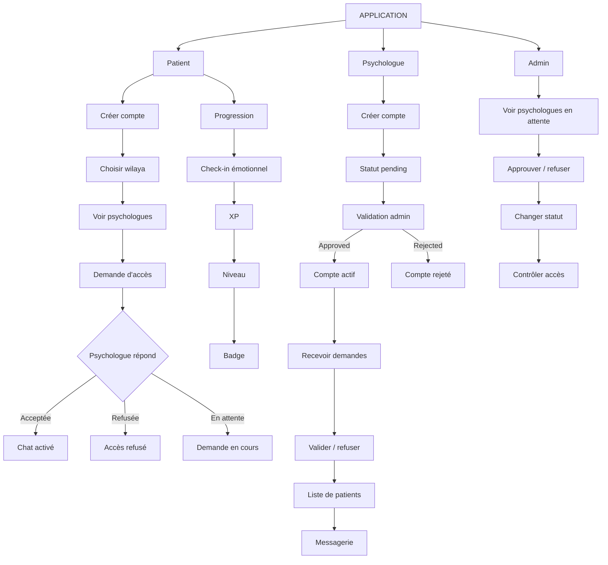
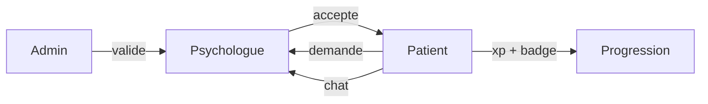

# SCHÉMA GLOBAL - ORGANIGRAMME

```mermaid
flowchart TD
    A[APPLICATION] --> B[Patient]
    A --> C[Psychologue]
    A --> D[Admin]

    B --> B1[Créer compte]
    B1 --> B2[Choisir wilaya]
    B2 --> B3[Voir psychologues]
    B3 --> B4[Demande d'accès]
    B4 --> B5{Psychologue répond}
    B5 -->|Acceptée| B6[Chat activé]
    B5 -->|Refusée| B7[Accès refusé]
    B5 -->|En attente| B8[Demande en cours]

    C --> C1[Créer compte]
    C1 --> C2[Statut pending]
    C2 --> C3[Validation admin]
    C3 -->|Approved| C4[Compte actif]
    C3 -->|Rejected| C5[Compte rejeté]
    C4 --> C6[Recevoir demandes]
    C6 --> C7[Valider / refuser]
    C7 --> C8[Liste de patients]
    C8 --> C9[Messagerie]

    D --> D1[Voir psychologues en attente]
    D1 --> D2[Approuver / refuser]
    D2 --> D3[Changer statut]
    D3 --> D4[Contrôler accès]

    B --> B9[Progression]
    B9 --> B10[Check-in émotionnel]
    B10 --> B11[XP]
    B11 --> B12[Niveau]
    B12 --> B13[Badge]
```

```mermaid
flowchart LR
    ADMIN[Admin] -->|valide| PSYCHO[Psychologue]
    PATIENT[Patient] -->|demande| PSYCHO
    PSYCHO -->|accepte| PATIENT
    PATIENT -->|chat| PSYCHO
    PATIENT -->|xp + badge| PROG[Progression]
```