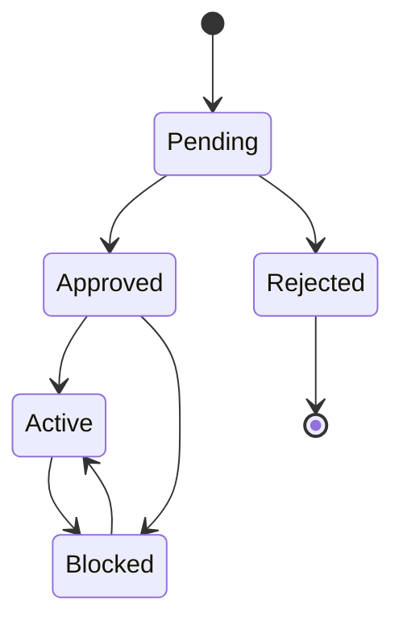
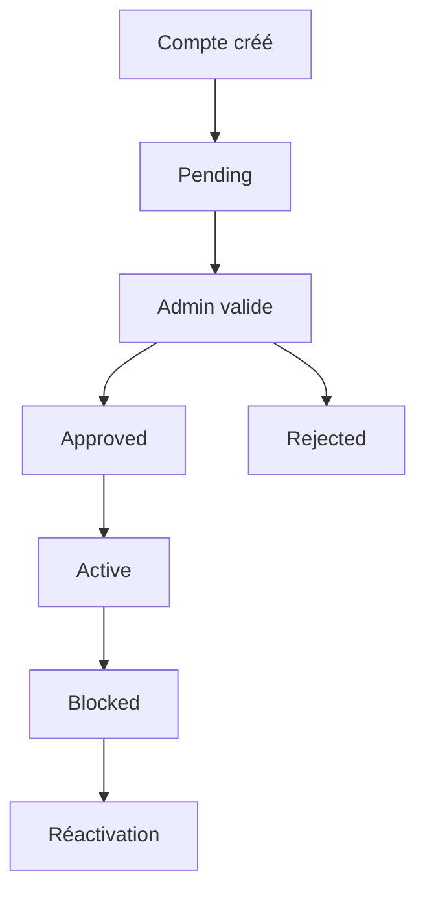
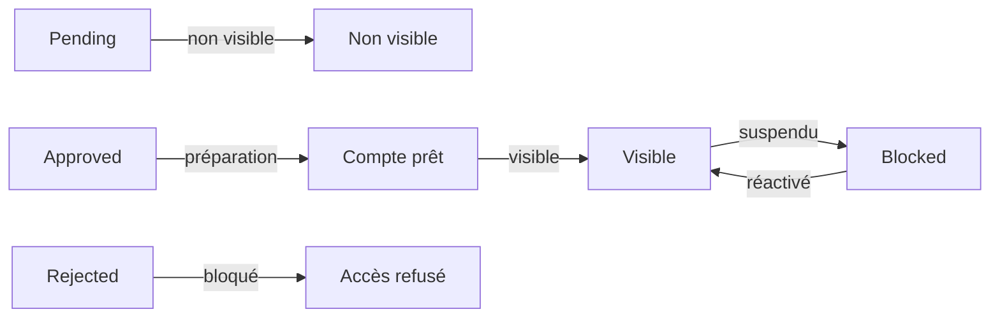
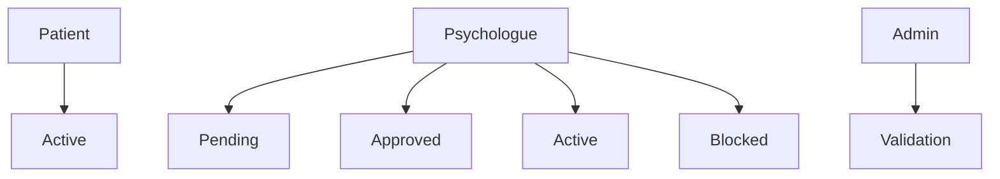

# SCHÉMA DES ÉTATS DES COMPTES

```mermaid
stateDiagram-v2
    [*] --> Pending
    Pending --> Approved
    Pending --> Rejected
    Approved --> Active
    Approved --> Blocked
    Active --> Blocked
    Blocked --> Active
    Rejected --> [*]
```

## EXPLICATION DES ÉTATS

```mermaid
flowchart TD
    A[Compte créé] --> B[Pending]
    B --> C[Admin valide]
    C --> D[Approved]
    C --> E[Rejected]
    D --> F[Active]
    F --> G[Blocked]
    G --> H[Réactivation]
```

## RÈGLES METIERS

```mermaid
flowchart LR
    P[Pending] -->|non visible| NP[Non visible]
    A[Approved] -->|préparation| AC[Compte prêt]
    AC -->|visible| V[Visible]
    V -->|suspendu| B[Blocked]
    B -->|réactivé| V
    R[Rejected] -->|bloqué| X[Accès refusé]
```

## PAR RÔLE

```mermaid
flowchart TB
    PATIENT[Patient] --> ACTIVE[Active]
    PSYCHO[Psychologue] --> PENDING[Pending]
    PSYCHO --> APPROVED[Approved]
    PSYCHO --> ACTIVE2[Active]
    PSYCHO --> BLOCKED[Blocked]
    ADMIN[Admin] --> VALIDATION[Validation]
```