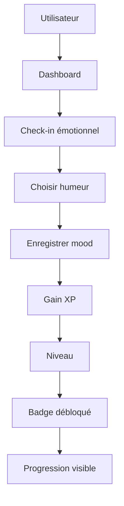
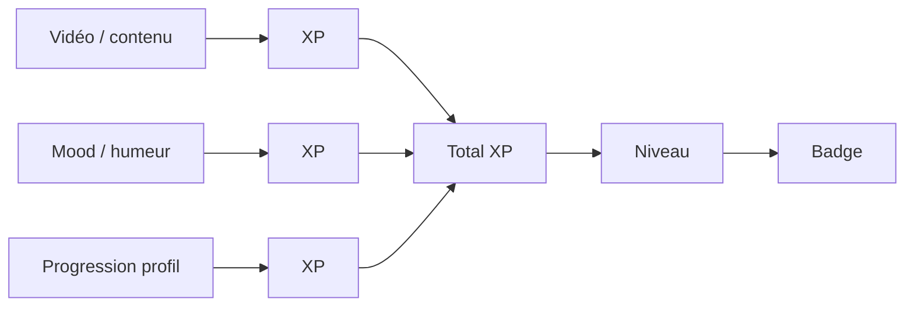
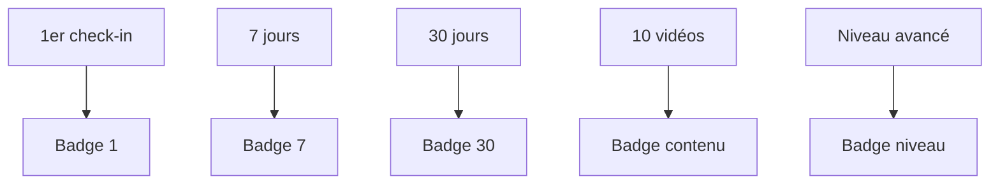
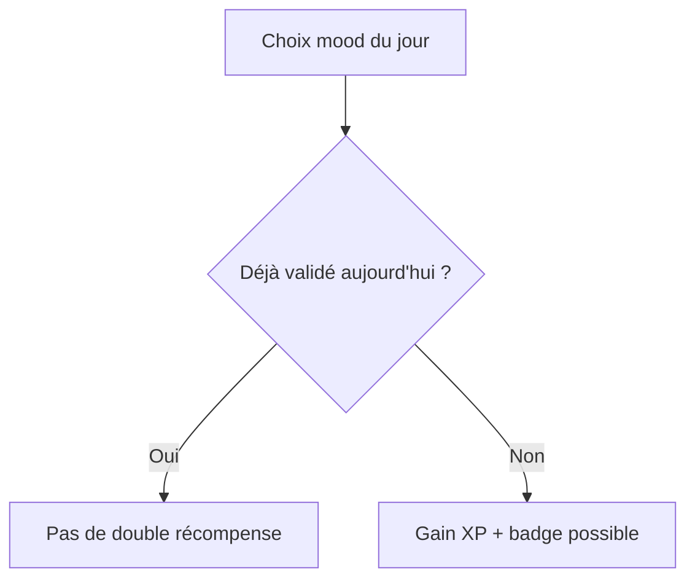
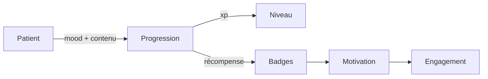

# SCHÉMA PROGRESSION - BADGES - CHECK-IN

```mermaid
flowchart TD
    A[Utilisateur] --> B[Dashboard]
    B --> C[Check-in émotionnel]
    C --> D[Choisir humeur]
    D --> E[Enregistrer mood]
    E --> F[Gain XP]
    F --> G[Niveau]
    G --> H[Badge débloqué]
    H --> I[Progression visible]
```

```mermaid
flowchart LR
    V[Vidéo / contenu] --> XP1[XP]
    M[Mood / humeur] --> XP2[XP]
    P[Progression profil] --> XP3[XP]
    XP1 --> T[Total XP]
    XP2 --> T
    XP3 --> T
    T --> N[Niveau]
    N --> B[Badge]
```

```mermaid
flowchart TB
    D1[1er check-in] --> B1[Badge 1]
    D2[7 jours] --> B2[Badge 7]
    D3[30 jours] --> B3[Badge 30]
    D4[10 vidéos] --> B4[Badge contenu]
    D5[Niveau avancé] --> B5[Badge niveau]
```

## RÈGLE IMPORTANT

```mermaid
flowchart TD
    A[Choix mood du jour] --> B{Déjà validé aujourd'hui ?}
    B -->|Oui| C[Pas de double récompense]
    B -->|Non| D[Gain XP + badge possible]
```

## VISION GLOBALE

```mermaid
flowchart LR
    PATIENT[Patient] -->|mood + contenu| PROG[Progression]
    PROG -->|xp| NIV[Niveau]
    PROG -->|récompense| BADGE[Badges]
    BADGE --> MOTI[Motivation]
    MOTI --> ENG[Engagement]
```